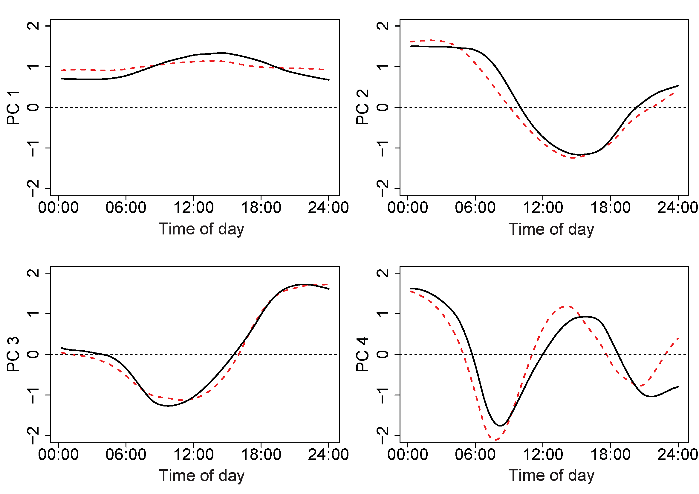
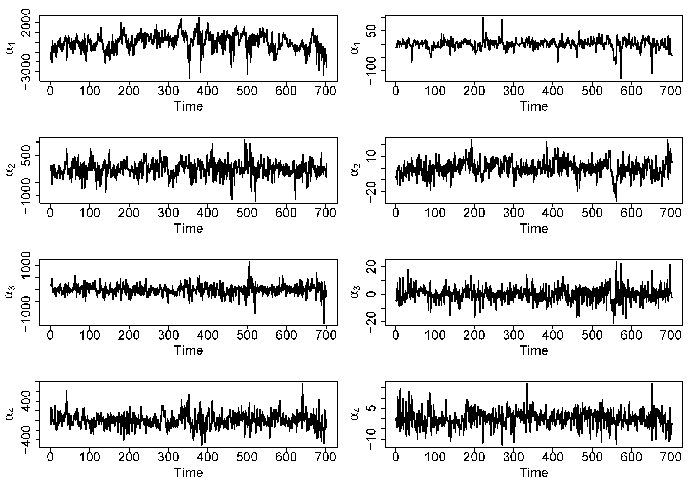
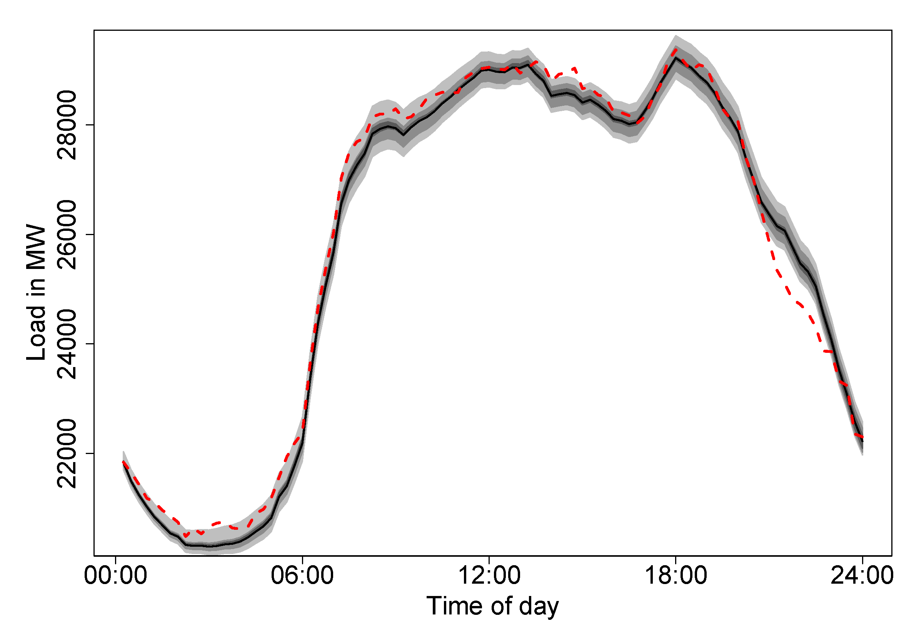

[](http://quantlet.de/)

## [](http://quantlet.de/) **FPCA_Electricity_Application** [](http://quantlet.de/)

```yaml

Name of QuantLet : FPCA_Electricity_Application

Published in : 'Forecasting generalized quantiles of electricity demand: A functional data
approach'

Description : 'Computes generalized quantiles of electicity demand and models their dynamics over
time using FPCA and multivariate time-series techniques'

Keywords : quantile, expectile, FPCA, loss function, time-series

See also : FPCA_Electricity_Simulation

Author : Franziska Schulz, Brenda López Cabrera

Submitted : 30.09.2016

Datafile : LoadTSO.txt

Input : FPCA_Electricity_Data.R, FPCA_Electricity_Functions

Example : 'Principal component functions and principal component scores. Forecast of expectile curves.'

```







### R Code:
```r
# Models the dynamics of electricity consumption of the TSO Amprion 
# using functional data analysis of generalized quantiles

rm(list = ls())
graphics.off()
#setwd("...")

source("FPCA_Electricity_Data.R")
source("FPCA_Electricity_Functions.R")

libraries = c("expectreg","fda.usc","sm","vars")
lapply(libraries,function(x)if(!(x %in% installed.packages())){install.packages(x)})
lapply(libraries,require,quietly=TRUE,character.only=TRUE)

## Table 1: Summary Statistics
statistics = function(x){c(median(x),mean(x),sd(x),min(x),max(x))}
stat = statistics(as.matrix(Load_mat[,-1]))
names(stat) = c("Median","Mean","SD","Min","Max")
stat

## Plot 2: Temperature, Sunshine
par(mar=c(5.2, 6.1, 2, 0.5)) 
par(mfrow = c(2,1))
plot(Temperature, type="l", lwd = 3, cex.axis = 2,xaxt='n', cex.lab = 2,ylab ="Temperature", xlab = "Time")
axis(1,c(175.5,526.5,877.5),c("2010","2011","2012"),cex.axis=2)
plot(Sun, type="l", lwd = 3, cex.axis = 2,xaxt='n', cex.lab = 2, xlab = "Time")
axis(1,c(175.5,526.5,877.5),c("2010","2011","2012"),cex.axis=2)

## Set parameter
n           = 702 
h           = 351 
k           = 0
tau         = c(0.01,0.05,0.25,0.5,0.75,0.95,0.99)

## Subset for insample modeling
training      = Load_mat[1:n,-1]
training_temp = Temperature[1:n] # 2 day forecast
training_sun  = Sun[1:n]
Load_list     = (unlist(as.data.frame(t(training))))

## DSC
tempseq = as.numeric(rep(rep(c(1:7),each=1),length.out=n+k+2))
WD = sapply(1:6, FUN = function(num){as.numeric(tempseq==num)})

DT_Load = dsc(Load_list, WD, dummy, n = n, k = k, hours = 96, p = 1)[[1]]

resid_data_yearly = matrix(DT_Load,nrow=96)
x   = seq(1/nrow(resid_data_yearly),1,length.out=nrow(resid_data_yearly)) # generate x
fit = array(0,dim=c(ncol(resid_data_yearly),96,7))

# Estimation of expectiles (this takes a while)
for(i in 1:ncol(resid_data_yearly)){
  (y = expectreg.ls(resid_data_yearly[,i]~rb(x,"pspline"),estimate="sheet",expectiles=tau,smooth="gcv"))
  fit[i,,] = y$fitted
}

result  = sapply(X = c(1: 7), FUN = fpca, fit = fit, x = x)
scores  = result[3,]

## Plot 4: PC
par(mar=c(5.2, 6.1, 2, 0.5)) 
par(mfrow = c(2,2))
sapply(1:4, plot.PC, num = 4, result = result)

## Plot 4: Scores
par(mar=c(5.2, 6.1, 2, 0.5)) 
par(mfrow = c(4,1))
sapply(1:4, plot.score, num = 4, result = result)

## Table 2/3: Explained Variance
varprop = result[4,]
varprop

resid_temp = season.cov(training_temp, 351)
resid_sun  = season.cov(training_sun, 351)

exo           = cbind( resid_temp,resid_sun)
colnames(exo) = c("Temperature","Sunshine")

## Table 4/5: VAR model
model = sapply(c(1:7), FUN = var.model, scores = scores, exo = exo)
rownames(model) = c("Temperature", "Sunshine")
model[,2]
model[,4]
model[,6]

```
